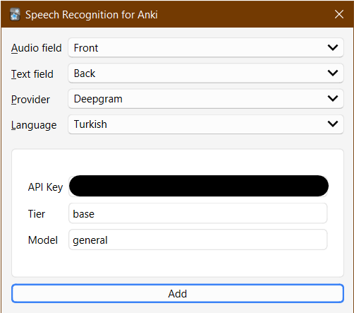

[Anki](https://apps.ankiweb.net/) add-on for [speech recognition](https://en.wikipedia.org/wiki/Speech_recognition).

## Supported speech-to-text services

Currently supported services are the following:

-   [Deepgram](https://deepgram.com/)
-   [Whisper](https://openai.com/research/whisper)

## Usage

Most speech recognition services require you to register for an API key. Check the docs of your chosen service for details.
You can configure your API key from the add-on's dialog accessible from the editor button ().



### Fill-in option

You can paste the transcriptions of audio files in a chosen field to any other field using the editor button or the _Notes > Transcribe Selected_ browser action for bulk processing.

### As a template filter

The add-on can also work as a template filter (`asr`, for "automatic speech recognition" or "Anki speech recognition"), which you put in your [card template](https://docs.ankiweb.net/templates/intro.html). E.g:

```
{{asr:Front}}
```

The add-on processes any `[sound:foo.mp3]` tags in the specified field and replaces them with the transcriptions of the audio. The results will be cached to avoid making additional requests to the ASR service in subsequent reviews. Compared to [Fill-in option](#fill-in-option), this has the advantage that newly created notes can make use of the add-on automatically as long as their card template contains the filter.

You can specify the language using the `lang` option. E.g:

```
{{asr lang=tr:Front}}
```

The default language is English (`en`). Supported languages depend on the service used. For Deepgram, see https://deepgram.com/product/languages/ for a list of supported languages.

The speech-to-text service used can be specified using the `provider` option. E.g:

```
{{asr provider=deepgram:Front}}
```

If you set `auto=false`, a button will be shown that you can click to show the transcription:

```
{{asr auto=false:Front}}
```

This is useful to avoid making a request to the ASR service when not needed, or to simply use the transcription as an optional hint.

You can see a list of each provider's supported languages by placing something like the following on your template:

```
{{asr-langs provider=deepgram:}}
```

This will list each supported language's code and name. The language code is what you have to provide to the `lang` option.

## Advanced

### Custom providers

If you know Python, you can integate any ASR service via a custom provider. See [user_files/providers/my_provider.py](src/user_files/providers/my_provider.py) for an example. If your provider is general enough to warrant including in the add-on, please open a pull request!

## Download

The the add-on can be downloaded from AnkiWeb: https://ankiweb.net/shared/info/411601849

## Changelog

See [CHANGELOG.md](CHANGELOG.md) for a list of changes.

## Credit

The icon is adapted from [Bootstrap Icons](https://icons.getbootstrap.com/); licensed under the MIT.

## Support & feature requests

Please post any questions, bug reports, or feature requests in the [support page](https://forums.ankiweb.net/c/add-ons/11) or the [issue tracker](https://github.com/abdnh/anki-asr/issues).

If you want priority support for your feature/help request, I'm available for hire.
You can get in touch from the aforementioned pages, via [email](mailto:abdo@abdnh.net) or on [Fiverr](https://www.fiverr.com/abd_nh).

## Support me

Consider supporting me if you like my work:

<a href="https://github.com/sponsors/abdnh"></a>
<a href="https://www.patreon.com/abdnh"></a>
<a href="https://www.buymeacoffee.com/abdnh" target="_blank"></a>

I'm also available for freelance add-on development on Fiverr:

<a href="https://www.fiverr.com/abd_nh/develop-an-anki-addon"></a>
